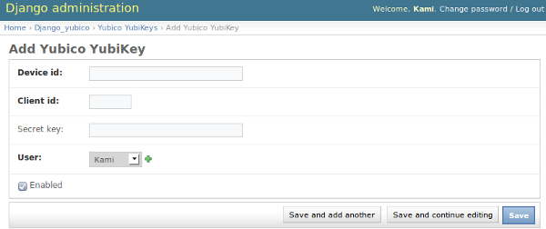

===========
Installation
===========

Step 1: Install yubico-python module
------------------------------------

This module requires yubico-python_ module to work.

If you don't already have it, you can install the latest stable version from PyPi::

  pip install yubico

Alternatively, if you are not afraid of bugs and like to live on the edge, you can install latest development version from the git repository::

  pip install -e git://github.com/Kami/python-yubico-client.git#egg=python-yubico-client

Step 2: Install this module
---------------------------
After the requirements are satisfied you can use the following command to install this module from PyPi::

  pip install django_yubico
  
Alternatively you can also install the latest development version from the git repository::

  pip install -e http://github.com/Kami/django-yubico-authentication-backend#egg=django-yubico

Step 3: Add django_yubico to the INSTALLED_APPS
-----------------------------------------------

Once the ``django_yubico`` is in your Python path, you need to modify the ``INSTALLED_APPS`` setting to include the ``django_yubico`` module::

    INSTALLED_APPS = (
        # ...,
        # Third-party
        'django_yubico',
        # ...,
    )

Step 4: Run syncdb to generate the necessary table
-----------------------------------------------

Run syncdb (this will create the database table which holds data about the YubiKeys):

    python manage.py syncdb
    
    
Step 5: Login to the admin panel and add one or more YubiKeys
-----------------------------------------------

Login to the Django admin panel, visit the ``Django_yubico`` application setting and add a new YubiKey for your user account:

* ``Device id`` - the first 12 characters of the token (you can obtain it by generating an OTP and taking first 12 characters)
* ``Client id`` - your client id (you can obtain it by visiting the `Yubico website`_)
* ``Secret key``- this field is optional and you only need to specify it if you want to use server response message `HMAC-SHA1 signature verification` (you can obtain it on the same page where you get your client id)
* ``User`` - The user which will be able to login with this YubiKey (remember that you can map a single YubiKey to multiple users)
* ``Enabled`` - You can optionally disable this YubiKey (meaning that you won't be able to login using this YubiKey until you enable it)

When you click save, key should be successfully added and you are almost done.

.. image:: images/view_keys.png

Step 6: Enable the custom authentication backend
------------------------------------------------    

To activate this backend you need at least put ``django_yubico.backends.YubicoBackend`` line to the ``AUTHENTICATION_BACKENDS`` tuple:

    AUTHENTICATION_BACKENDS = (
    		'django_yubico.backends.YubicoBackend',
    )
    
For more information about the available backends and how they work, please visit the :doc:`available authentication backends` page.
    
Step 7: Load the module urls.py file
----------------------------

Put the following line in your ``urls.py`` file::

    (r'^yubico/', include('django_yubico.urls')),

Step 8: Test if everything works
----------------------------

Visit http://yourpage.com/yubico/login/ and if everything went ok you should be able to login using your website username, OTP generated by YubiKey and a password.

By default you need to enter both - first your username and OTP and in the second step, your account password. For more information how to change this behavior, visit the :doc:`settings` page.

.. _yubico-python: http://github.com/Kami/python-yubico-client
.. _`Yubico website`: https://api.yubico.com/get-api-key/
.. _`HMAC-SHA1 signature verification`: http://code.google.com/p/yubikey-val-server-php/wiki/ValidationProtocolV20